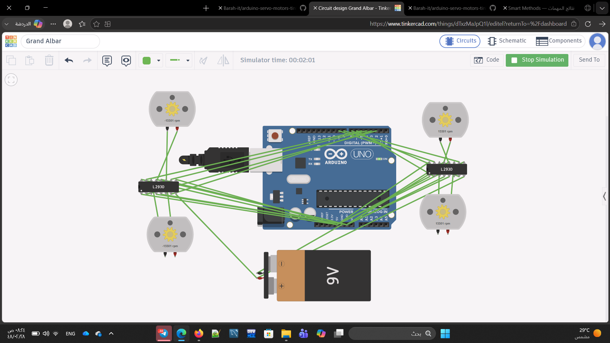

# 4 DC Motors Control Using L293D

An Arduino Tinkercad project that controls four DC motors using two L293D motor drivers.

## Movements

- Forward: All motors move forward for 30 seconds.
- Backward: All motors move backward for 60 seconds.
- Turning: Motors alternate between right and left turns for 60 seconds.
- Stop: All motors stop after completing the sequence.

## Components

- Arduino Uno
- 2× L293D Motor Drivers
- 4× DC Motors
- 9V Battery
- Jumper Wires
- Tinkercad

## Implementation

The Arduino controls the L293D input pins to change the direction of the motors. The sequence is executed once in setup() using separate functions for forward, backward, right turn, left turn, and stopping the motors.

## Circuit

## Files

- dc_motors_l293d.ino — Arduino code
- circuit_full.png — Circuit screenshot
- Simulation Video — Demonstration
